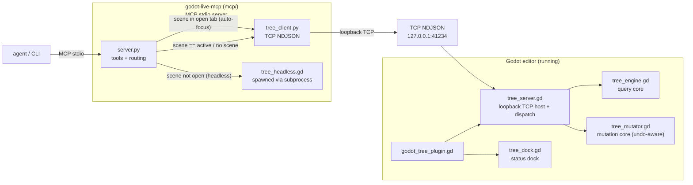

# godot-live-mcp

Agent-facing scene tree inspector for the Godot editor: query the **live,
in-memory** edited scene over a loopback TCP bridge, so the editor's RAM is
always the source of truth (the `.tscn` file only changes on explicit save).
Ships as a Godot editor plugin plus an MCP server so AI agents can inspect the
scene in real time.

## Architecture



The MCP server **routes each op in the Python layer**: with no `scene` arg, or
when the `scene` equals the currently-edited scene, it talks to the live bridge
(`tree_client.py` → `tree_server.gd`), so edits are undoable in the editor. If
the `scene` is open in **another tab**, the server auto-focuses that tab
(`open_scene_from_path`), runs the op on the live in-memory copy, then restores
your previous active scene — so open-tab edits never touch the on-disk file and
never trigger a reload prompt. Only a scene that is **not open at all** is edited
by a headless `godot` subprocess (`tree_headless.gd`) that loads the `.tscn`
from disk, runs the same `tree_mutator.gd`/`tree_engine.gd` core, and saves it
back.

## OpenCode (primary)

1. Open this project in the Godot editor (plugin auto-starts the bridge on
   `127.0.0.1:41234`).
2. The repo's `opencode.json` registers the MCP server:

   ```json
   {
     "mcp": {
       "godot-live": {
         "type": "local",
         "command": ["uv", "run", "godot-live-mcp"],
         "cwd": "mcp",
         "enabled": true,
         "timeout": 20000,
         "environment": { "GODOT_TREE_PORT": "41234" }
       }
     }
   }
   ```

   (Copy it into any project's `opencode.json` — the bridge lives in the
   editor, so it works from any workspace that has this plugin enabled.)

3. Use the tools in your prompts, e.g. `use godot-live_tree_find to locate the
Player node`.

### Tools

| Tool                             | Args                                                       | Description                                                                                                                                                                                                                                                                   |
| -------------------------------- | ---------------------------------------------------------- | ----------------------------------------------------------------------------------------------------------------------------------------------------------------------------------------------------------------------------------------------------------------------------- |
| `godot-live_tree_ping`           | –                                                          | Bridge + scene health check                                                                                                                                                                                                                                                   |
| `godot-live_tree_editor`         | –                                                          | Engine/project info: Godot version, project name, project path, current scene                                                                                                                                                                                                 |
| `godot-live_tree_scene`          | –                                                          | Current scene: root name/type, node count, unsaved-modified flag                                                                                                                                                                                                              |
| `godot-live_tree_open_scenes`    | –                                                          | Scenes currently open in the editor: `{"paths": [...], "scenes": {path: {name, node_count}}}`                                                                                                                                                                                 |
| `godot-live_tree_query`          | `path scene?`                                              | Summary of one node                                                                                                                                                                                                                                                           |
| `godot-live_tree_children`       | `path scene?`                                              | Direct children of a node                                                                                                                                                                                                                                                     |
| `godot-live_tree_props`          | `path scene?`                                              | Exported (editor-visible) properties                                                                                                                                                                                                                                          |
| `godot-live_tree_find`           | `path? type? name? script? has_prop? path_pattern? scene?` | Filtered search (`name`/`script` accept globs; `path_pattern` matches absolute paths segment-wise, e.g. `/A/*/C`)                                                                                                                                                             |
| `godot-live_tree_inspect`        | `path scene?`                                              | Semantic output via `agent_inspect()`                                                                                                                                                                                                                                         |
| `godot-live_tree_dump`           | `path? depth? scene?`                                      | Nested tree dump (depth 0 = node only, default 2)                                                                                                                                                                                                                             |
| `godot-live_tree_set`            | `path property value scene?`                               | Set a property (undoable, marks scene unsaved)                                                                                                                                                                                                                                |
| `godot-live_tree_add`            | `parent_path node_type node_name properties? scene?`       | Add a node (undoable, marks scene unsaved)                                                                                                                                                                                                                                    |
| `godot-live_tree_remove`         | `path scene?`                                              | Remove a node (undoable, marks scene unsaved)                                                                                                                                                                                                                                 |
| `godot-live_tree_move`           | `path parent_path index? scene?`                           | Reparent/reorder a node (undoable, marks scene unsaved)                                                                                                                                                                                                                       |
| `godot-live_attach_script`       | `path script scene?`                                       | Attach an existing `.gd` script (`res://` path) to a node; validates it loads and its base type matches the node (undoable, marks scene unsaved)                                                                                                                               |
| `godot-live_create_scene`        | `root_type root_name save_path children?`                  | Build a whole scene in-memory from a declarative nested spec and save it to a `.tscn`; detached (no new-scene editor entry), returns the serialized tree                                                                                                                      |
| `godot-live_log_read`            | `since? limit?`                                            | Delta-read captured `print`/`push_error`/`push_warning` output (Godot >= 4.5; see below)                                                                                                                                                                                      |
| `godot-live_log_probe`           | `message? level?`                                          | Emit a std output/error log from the editor process to test `log_read` capture                                                                                                                                                                                                |
| `godot-live_get_uid`             | `path? uid?`                                               | Look up a resource UID (Godot 4.4+): pass a `res://` path or a `uid://` string; returns `{"path", "uid"}` for either direction                                                                                                                                                |
| `godot-live_update_project_uids` | `dry_run?`                                                 | Assign a UID to every project resource that lacks one, persisting `.uid` files (Godot 4.4+); mirrors Project > Tools > "Update UIDs". `dry_run` previews without writing                                                                                                      |
| `godot-live_project_get_setting` | `path`                                                     | Read a project setting from the live editor's `project.godot`. `path` is either exact (e.g. `application/config/name`, returns `{"path", "value"}`) or a simple filter — a prefix or `*` glob (e.g. `application/*`, returns `{"path", "count", "settings"}` for every match) |
| `godot-live_set_main_scene`      | `scene`                                                    | Set the project's main scene (`application/run/main_scene`) in `project.godot` and persist it; validates the scene loads as a `PackedScene`, returns `{"path", "previous"}`                                                                                                    |

Read ops map to the bridge 1:1; mutation ops go through the editor's
`EditorUndoRedoManager`, so they're **undoable in the editor** (Ctrl+Z) and
automatically mark the scene unsaved. Agent-made mutations are tagged in the
undo **History panel** with a prefix (default `[agent] Add SmokeTestNode`),
configurable via Editor Settings → `addons/godot_tree/agent_undo_prefix`
(empty string disables the tag).

`create_scene` is the exception: it builds a new scene **detached** from the
currently edited scene (in-memory, saved straight to disk via `ResourceSaver`),
so it is _not_ undoable, does _not_ mark a scene unsaved, and is not opened as a
new editor scene (there is no new-scene entry point) — open the saved `.tscn`
with File > Open. `children` is a nested list of
`{"node_type", "node_name", "properties"?, "children"?}` dicts; properties use
the same values as `tree_set`.

### Editing scenes that aren't open

Every read/mutation tool takes an optional `scene` (a `res://` path). Routing
happens in the MCP server (Python layer):

- **No `scene` given** → operate on the live edited scene through the bridge
  (legacy behavior; undoable).
- **`scene` given and it equals the currently edited scene** → live bridge.
- **`scene` given and it is open in another tab** → the server **auto-focuses**
  that tab (`open_scene_from_path`), runs the op on the editor's live in-memory
  copy (undoable, no on-disk write), then **restores your previous active
  scene**. This applies to both reads and writes, so they always reflect the
  live in-memory truth and never trigger a reload prompt.
- **`scene` given and it is _not_ open at all** → a **headless**
  `godot --headless` subprocess loads the `.tscn` from disk, runs the same
  `TreeMutator`/`TreeEngine` core (`addons/godot_tree/tree_headless.gd`),
  re-packs and saves it via `ResourceSaver`, and returns the serialized tree.
  These edits are **not undoable** (there is no editor undo stack for a scene
  that isn't being edited), and they write the file to disk immediately.

This lets an agent read or modify **multiple scenes** without opening them one at
a time, while keeping the currently-edited scene fully undoable.

> **Import cache (open for development).** Headless edits rely on the project's
> existing `.godot` import cache (so they work fine when the editor has already
> imported the project). v2 plans to rescan/import resources automatically before
> a headless edit when the cache is missing or stale (e.g. `godot --headless
--import`), driven from the Python layer.

> **Project settings are mostly read-only.** `project_get_setting` can _read_ any
> setting, but a general write (`project_set_setting`) is intentionally **not
> implemented**: mutating `project.godot` is easy to get wrong and can corrupt the
> project, so it is left out until a safe, auditable write path (e.g. review/undo
> of agent changes) is designed. Use the editor for general edits. The **one
> narrow, auditable exception** is `set_main_scene`, which writes only the single
> `application/run/main_scene` key after validating the target scene loads as a
> `PackedScene`.

Env vars (optional): `GODOT_TREE_HOST` (default `127.0.0.1`),
`GODOT_TREE_PORT` (default `41234`, must match the addon's Editor Setting),
`GODOT_TREE_TIMEOUT_MS` (default `5000`), `GODOT_BIN` (godot binary for headless
edits; defaults to `godot` on `PATH`), `GODOT_PROJECT` (project dir for headless
edits; defaults to the live editor's project path, then the working directory).

Published install (once published to PyPI): `"command": ["uvx", "godot-live-mcp"]`.
Claude Code (future): same stdio server, `claude mcp add godot-live -- uvx godot-live-mcp`.

## CLI

Open this project in the Godot editor (plugin auto-starts the bridge on
`127.0.0.1:41234`), then from any terminal:

```sh
godot --headless -s addons/godot_tree/tree_cli.gd -- ping
godot --headless -s addons/godot_tree/tree_cli.gd -- scene
godot --headless -s addons/godot_tree/tree_cli.gd -- editor
godot --headless -s addons/godot_tree/tree_cli.gd -- tree /City 2
godot --headless -s addons/godot_tree/tree_cli.gd -- children /City
godot --headless -s addons/godot_tree/tree_cli.gd -- query /City/Chapel 8
godot --headless -s addons/godot_tree/tree_cli.gd -- find --type Node2D
godot --headless -s addons/godot_tree/tree_cli.gd -- find --name "Office*"
godot --headless -s addons/godot_tree/tree_cli.gd -- find --path-pattern '/*/Plaza/*'
godot --headless -s addons/godot_tree/tree_cli.gd -- props /City/Office 0
godot --headless -s addons/godot_tree/tree_cli.gd -- inspect /City/Chapel 8
godot --headless -s addons/godot_tree/tree_cli.gd -- set /City/Office visible --value false
godot --headless -s addons/godot_tree/tree_cli.gd -- add /City Node2D Office --properties '{"position": [10, 20]}'
godot --headless -s addons/godot_tree/tree_cli.gd -- create_scene Node2D City res://scenes/city.tscn --children '[{"node_type":"Node2D","node_name":"Plaza"}]'
godot --headless -s addons/godot_tree/tree_cli.gd -- move /City/Office /
godot --headless -s addons/godot_tree/tree_cli.gd -- attach_script /City/Office res://scripts/office.gd
godot --headless -s addons/godot_tree/tree_cli.gd -- remove /City/Office
godot --headless -s addons/godot_tree/tree_cli.gd -- get_uid res://scenes/city.tscn
godot --headless -s addons/godot_tree/tree_cli.gd -- get_uid --uid uid://cgqx7mih5boao
godot --headless -s addons/godot_tree/tree_cli.gd -- update_project_uids --dry-run
godot --headless -s addons/godot_tree/tree_cli.gd -- update_project_uids
```

`tree_cli.gd` talks to the running editor's bridge. To read/edit a scene **on
disk** without the editor (what the MCP uses for non-open scenes), run
`tree_headless.gd` directly:

```sh
godot --headless --path <project> -s addons/godot_tree/tree_headless.gd -- res://scenes/level_cave.tscn query --args '{"path": "/Walls"}'
godot --headless --path <project> -s addons/godot_tree/tree_headless.gd -- res://scenes/level_cave.tscn add  --args '{"parent_path": "/Enemies", "node_type": "Node2D", "node_name": "Boss"}'
godot --headless --path <project> -s addons/godot_tree/tree_headless.gd -- res://scenes/level_cave.tscn set  --args '{"path": "/Enemies", "property": "position", "value": [5, 7]}'
```

Port override: Editor Settings → `addons/godot_tree/port`, or restart the
bridge from the dock ("Port..." button). Nodes that implement
`agent_inspect() -> Dictionary` get semantic output via the `inspect` op.

## Tests

```sh
godot --headless -s tests/tree_engine_test.gd   # query core (GDScript)
godot --headless -s tests/tree_mutator_test.gd  # mutation core: set/add/remove/move (GDScript)
godot --headless -s tests/tree_headless_test.gd # headless load/mutate/save core (GDScript)
godot --headless -s tests/tree_server_test.gd   # TCP round trip + lifecycle (GDScript)
godot --headless -s tests/tree_dock_test.gd     # dock status smoke test (GDScript)
uv run --directory mcp pytest                   # MCP server (Python, fake TCP)
```

## Version support

Godot **4.x** (tested on 4.7.1). The TCP bridge and mutations are
version-agnostic: the undo API differences across 4.0–4.7 (`UndoRedo` vs
`EditorUndoRedoManager`, Callable vs `(object, method, ...)` signatures) are
detected at runtime, so no version-specific class names are referenced.

The editor **dock** uses `EditorDock`, which only exists in Godot **4.5+**; on
earlier versions the plugin falls back to **bridge-only** (the dock is skipped,
everything else — TCP bridge, CLI, MCP tools — still works). The plugin is
developed against `config/features=PackedStringArray("4.7")`.

**Log capture** (`log_read`) requires Godot **4.5+**, since it uses the
`Logger`/`OS.add_logger()` API. On older versions the bridge simply reports
`logging not available`; the rest of the plugin is unaffected.

**Resource UID tools** (`get_uid`, `update_project_uids`) require Godot **4.4+**
(the `.uid` sidecar format / "Update UIDs" tool). On older versions they report
`resource UIDs require Godot 4.4+`.

### Log reading (`godot-live_log_read`)

The plugin registers a custom `Logger` that captures `print` (info),
`push_error` (error), and `push_warning` (warning) into a **bounded ring buffer**
(max 2000 entries) inside the running editor. Reads are **delta-based**: call
with `since` = the last `seq` you saw (0 = everything currently buffered) and
you get `{"seq", "base_seq", "entries"}` where `entries` are messages newer than
`since`; pass the returned `seq` back as the next `since` to tail the log
efficiently without re-sending history. `limit` caps the response size (0 =
unlimited). Capture callbacks run on worker threads, so the ring buffer is
mutex-protected; memory stays bounded regardless of log volume.

To fire a std output/error log on demand for testing, use
`godot-live_log_probe` (or `{"op":"log_probe","args":{...}}` over the bridge): it
calls `print()`/`push_error()`/`push_warning()` in the editor process, which the
capture logger picks up and the next `log_read` returns.

> **Scope (open for development).** Capture is currently limited to the editor
> process's **standard output/error stream** (`print`/`push_error`/`push_warning`).
> Two channels are **not** captured yet:
>
> - **Editor-internal messages** — the gray lines the editor itself emits to the
>   Output panel outside the std output stream (e.g. bridge/dock activity).
> - **Running-game output** — logs from a launched game (F5) relayed via the
>   debugger protocol, which is a separate channel from the editor's std stream.
>   Capturing these is future work (e.g. an `EditorDebuggerPlugin`).

## Protocol

Newline-delimited JSON over TCP. Request:

```json
{ "id": 1, "op": "query", "args": { "path": "/City" } }
```

Response: `{"id": 1, "ok": true, "result": {...}}` or `{"id": 1, "ok": false, "error": "..."}`.

Ops: `ping`, `scene`, `editor`, `open_scenes`, `focus_scene`, `tree`, `query`, `children`, `props`, `find`, `inspect`, `set`, `add`, `remove`, `move`, `attach_script`, `create_scene`, `get_uid`, `update_project_uids`, `get_setting`, `set_main_scene`.

## Next steps

- **v2 import rescan (open for development):** before a headless edit, check the
  project's `.godot` import cache; when missing or stale (a source resource is
  newer than the cache), run `godot --headless --import` first, driven from the
  Python layer with a per-project cache flag.
