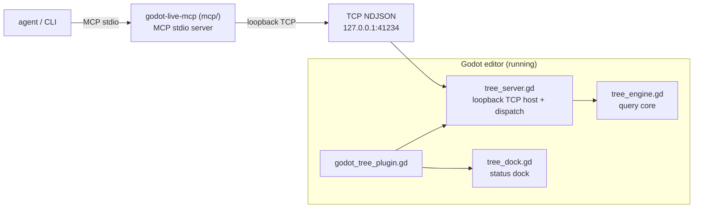

# godot-live-mcp

Agent-facing scene tree inspector for the Godot editor: query the **live,
in-memory** edited scene over a loopback TCP bridge, so the editor's RAM is
always the source of truth (the `.tscn` file only changes on explicit save).
Ships as a Godot editor plugin plus an MCP server so AI agents can inspect the
scene in real time.

## Architecture



## OpenCode (primary)

1. Open this project in the Godot editor (plugin auto-starts the bridge on
   `127.0.0.1:41234`).
2. The repo's `opencode.json` registers the MCP server:

   ```json
   {
     "mcp": {
       "godot-live": {
         "type": "local",
         "command": ["uv", "run", "godot-live-mcp"],
         "cwd": "mcp",
         "enabled": true,
         "timeout": 20000,
         "environment": { "GODOT_TREE_PORT": "41234" }
       }
     }
   }
   ```

   (Copy it into any project's `opencode.json` — the bridge lives in the
   editor, so it works from any workspace that has this plugin enabled.)

3. Use the tools in your prompts, e.g. `use godot-live_tree_find to locate the
   Player node`.

### Tools

| Tool | Args | Description |
|------|------|-------------|
| `godot-live_tree_ping` | – | Bridge + scene health check |
| `godot-live_tree_editor` | – | Engine/project info: Godot version, project name, project path, current scene |
| `godot-live_tree_scene` | – | Current scene: root name/type, node count, unsaved-modified flag |
| `godot-live_tree_query` | `path` | Summary of one node |
| `godot-live_tree_children` | `path` | Direct children of a node |
| `godot-live_tree_props` | `path` | Exported (editor-visible) properties |
| `godot-live_tree_find` | `path? type? name? script? has_prop? path_pattern?` | Filtered search (`name`/`script` accept globs; `path_pattern` matches absolute paths segment-wise, e.g. `/A/*/C`) |
| `godot-live_tree_inspect` | `path` | Semantic output via `agent_inspect()` |
| `godot-live_tree_dump` | `path? depth?` | Nested tree dump (depth 0 = node only, default 2) |
| `godot-live_tree_set` | `path property value` | Set a property (undoable, marks scene unsaved) |
| `godot-live_tree_add` | `parent_path node_type node_name properties?` | Add a node (undoable, marks scene unsaved) |
| `godot-live_tree_remove` | `path` | Remove a node (undoable, marks scene unsaved) |
| `godot-live_tree_move` | `path parent_path index?` | Reparent/reorder a node (undoable, marks scene unsaved) |

Read ops map to the bridge 1:1; mutation ops go through the editor's
`EditorUndoRedoManager`, so they're **undoable in the editor** (Ctrl+Z) and
automatically mark the scene unsaved. Agent-made mutations are tagged in the
undo **History panel** with a prefix (default `[agent] Add SmokeTestNode`),
configurable via Editor Settings → `addons/godot_tree/agent_undo_prefix`
(empty string disables the tag).

Env vars (optional): `GODOT_TREE_HOST` (default `127.0.0.1`),
`GODOT_TREE_PORT` (default `41234`, must match the addon's Editor Setting),
`GODOT_TREE_TIMEOUT_MS` (default `5000`).

Published install (once published to PyPI): `"command": ["uvx", "godot-live-mcp"]`.
Claude Code (future): same stdio server, `claude mcp add godot-live -- uvx godot-live-mcp`.

## CLI

Open this project in the Godot editor (plugin auto-starts the bridge on
`127.0.0.1:41234`), then from any terminal:

```sh
godot --headless -s addons/godot_tree/tree_cli.gd -- ping
godot --headless -s addons/godot_tree/tree_cli.gd -- scene
godot --headless -s addons/godot_tree/tree_cli.gd -- editor
godot --headless -s addons/godot_tree/tree_cli.gd -- tree /City 2
godot --headless -s addons/godot_tree/tree_cli.gd -- children /City
godot --headless -s addons/godot_tree/tree_cli.gd -- query /City/Chapel 8
godot --headless -s addons/godot_tree/tree_cli.gd -- find --type Node2D
godot --headless -s addons/godot_tree/tree_cli.gd -- find --name "Office*"
godot --headless -s addons/godot_tree/tree_cli.gd -- find --path-pattern '/*/Plaza/*'
godot --headless -s addons/godot_tree/tree_cli.gd -- props /City/Office 0
godot --headless -s addons/godot_tree/tree_cli.gd -- inspect /City/Chapel 8
godot --headless -s addons/godot_tree/tree_cli.gd -- set /City/Office visible --value false
godot --headless -s addons/godot_tree/tree_cli.gd -- add /City Node2D Office --properties '{"position": [10, 20]}'
godot --headless -s addons/godot_tree/tree_cli.gd -- move /City/Office /
godot --headless -s addons/godot_tree/tree_cli.gd -- remove /City/Office
```

Port override: Editor Settings → `addons/godot_tree/port`, or restart the
bridge from the dock ("Port..." button). Nodes that implement
`agent_inspect() -> Dictionary` get semantic output via the `inspect` op.

## Tests

```sh
godot --headless -s tests/tree_engine_test.gd   # query core (GDScript)
godot --headless -s tests/tree_mutator_test.gd  # mutation core: set/add/remove/move (GDScript)
godot --headless -s tests/tree_server_test.gd   # TCP round trip + lifecycle (GDScript)
godot --headless -s tests/tree_dock_test.gd     # dock status smoke test (GDScript)
uv run --directory mcp pytest                   # MCP server (Python, fake TCP)
```

## Version support

Godot **4.x** (tested on 4.7.1). The TCP bridge and mutations are
version-agnostic: the undo API differences across 4.0–4.7 (`UndoRedo` vs
`EditorUndoRedoManager`, Callable vs `(object, method, ...)` signatures) are
detected at runtime, so no version-specific class names are referenced.

The editor **dock** uses `EditorDock`, which only exists in Godot **4.5+**; on
earlier versions the plugin falls back to **bridge-only** (the dock is skipped,
everything else — TCP bridge, CLI, MCP tools — still works). The plugin is
developed against `config/features=PackedStringArray("4.7")`.

## Protocol

Newline-delimited JSON over TCP. Request:

```json
{"id": 1, "op": "query", "args": {"path": "/City"}}
```

Response: `{"id": 1, "ok": true, "result": {...}}` or `{"id": 1, "ok": false, "error": "..."}`.

Ops: `ping`, `scene`, `editor`, `tree`, `query`, `children`, `props`, `find`, `inspect`, `set`, `add`, `remove`, `move`.

## Next steps

- Script attachment (`attach_script`) and set-main-scene.
- Scene save/load ops (`save_scene`) to persist mutations to disk.
